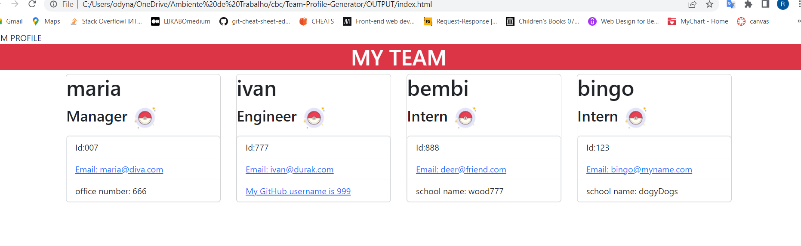
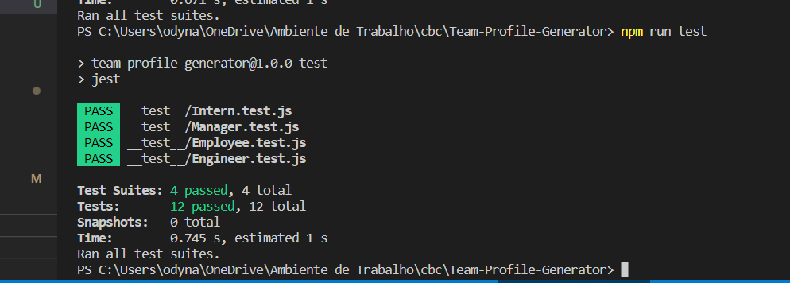

# Team-Profile-Generator
## Description
A command-line application that accepts user input. HTML file is generated that displays a nicely formatted team roster based on user input.GitHub profile opens in a new tab.Prompted to enter the team manager’s name, employee ID, email address, and office number.Presented with a menu with the option to add an engineer or an intern or to finish building my team.Pompted to enter the engineer’s name, ID, email, and GitHub username, and I am taken back to the menu.Rompted to enter the engineer’s name, ID, email, and GitHub username, and I am taken back to the menu.After exit the application, and the HTML is generated.

## Usage

 

## Built With

* [HTML](https://developer.mozilla.org/en-US/docs/Web/HTML)
* [CSS](https://developer.mozilla.org/en-US/docs/Web/CSS)
* [Javascript](https://developer.mozilla.org/en-US/docs/Web/JavaScript)
* [Bootstrap](https://maxcdn.bootstrapcdn.com)
  
## Authors

- [Link to Github](https://github.com/poucoLouco)

## License

This project is licensed under the MIT License 

## Tests

 